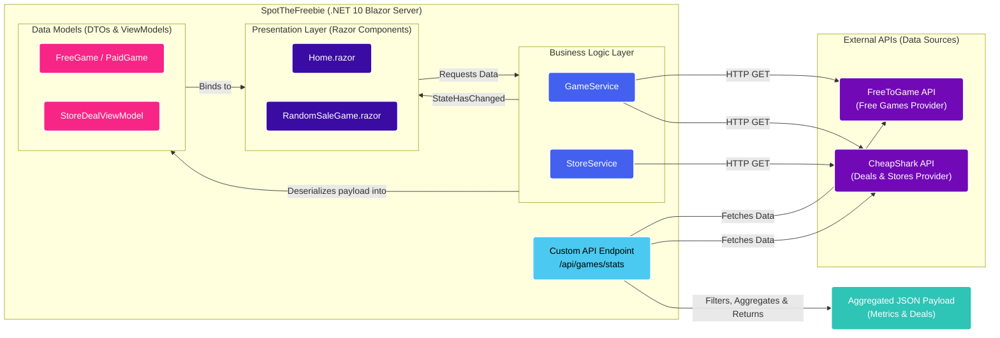

# SpotTheFreebie

**SpotTheFreebie** is a modern game discovery app built with **Blazor Server** and **.NET 10**. It helps users discover **free-to-play games** and **paid games with current discounts**, all in a responsive, real-time web experience.

---
The application will typically be available at `http://localhost:5000` or `https://localhost:5001`.

## Demo

Watch the project in action:

[](https://youtu.be/ROTBubuCTV0?si=UPrzcNK5F-ylEPBH)  

---

## Features

- **Discover free games** from the **FreeToGame API**
- **Browse paid games and live deals** from the **CheapShark API**
- **Random game selection** for both free and paid titles
- **Real-time UI updates** powered by **Blazor Server**
- **Statistics endpoint** that aggregates and processes data from external APIs
- **Responsive interface** built with **Blazor.Bootstrap**

---

## Known Limitations & Future Improvements
- **API Rate Limiting:** Since the app relies on free, public APIs, you might occasionally hit a "429 Too Many Requests" error. 
- **Caching:** Future updates will implement `IMemoryCache` to store fetched game deals and reduce the number of outgoing HTTP requests.

---

## Screenshots

### 1. Randomizing a Free Game


### 2. Randomizing a Paid Game Deal


### 3. Main Page with 4 App Selection Options


### 4. Statistics Chart/Data for Paid Games


---

## Architecture

SpotTheFreebie follows a clean, practical structure designed for maintainability and clear separation of concerns.

### Blazor Server Model

This app uses **Blazor Server**, which means:

- UI interactions happen over a real-time connection
- Application logic runs on the server
- State is updated efficiently without full page reloads
- The app can deliver a smooth, interactive experience with minimal client-side complexity

### Folder Structure

| Folder / Area | Purpose |
|---|---|
| `Components/Pages` | UI pages and views such as `Home.razor` and `RandomSaleGame.razor` |
| `Services` | Business logic and data access, including `GameService` and `StoreService` |
| `Models` | Data contracts and view models such as `FreeGame`, `PaidGame`, and `StoreDealViewModel` |
| `Program.cs` | App startup and the custom internal API endpoint |

### High-Level Flow


---

## Internal API

SpotTheFreebie includes a custom internal endpoint:

```http
/api/games/stats
```

### What it does

This endpoint, defined in `Program.cs`, combines data from both external APIs and returns processed statistics.

### Returned data includes

- **Top 5 genres**
- **Top 10 deals**
- Aggregated and transformed JSON output for use in charts, dashboards, or summary views

### Purpose

The endpoint provides a centralized way to serve computed game insights to the UI, reducing duplication and keeping presentation logic lightweight.

---

## Tech Stack

| Technology | Purpose |
|---|---|
| **.NET 10** | Application runtime and backend framework |
| **Blazor Server** | Interactive web UI with server-side execution |
| **Blazor.Bootstrap** | Responsive and modern UI components |
| **HttpClient** | Consuming external APIs |
| **FreeToGame API** | Free-to-play game data |
| **CheapShark API** | Game deals and discounts |

---

## Installation

### Prerequisites

- .NET 10 SDK
- Git

### Clone the repository

```bash
git clone https://github.com/livcia/SpotTheFreebie.git
cd SpotTheFreebie
```

### Restore dependencies

```bash
dotnet restore
```

### Run the application

```bash
dotnet run
```

If needed, open the application in your browser at the local URL shown in the terminal.

---

## Project Structure

```text
SpotTheFreebie/
├── Components/
│   └── Pages/
├── Models/
├── Services/
├── Program.cs
└── README.md
```

---

## API Summary

| Endpoint | Description |
|---|---|
| `/api/games/stats` | Fetches, filters, and aggregates live data from both FreeToGame and CheapShark APIs into a single statistics object. |

### Returned data includes

- **Top 5 genres** based on the current free games pool
- **Top 10 deals** sorted by the highest savings percentage
- **Total count of free games** (`FreeGamesTotal`) currently available
- **Average sale price** (`AverageSalePriceUsd`) calculated exclusively for paid titles
- Aggregated and transformed JSON output ready to be used in charts, dashboards, or summary views


## License
This project is licensed under the MIT License.

