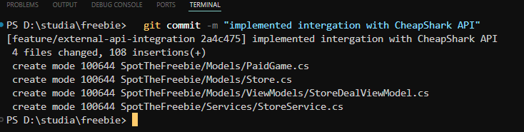
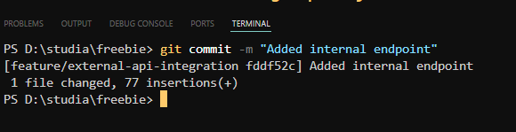
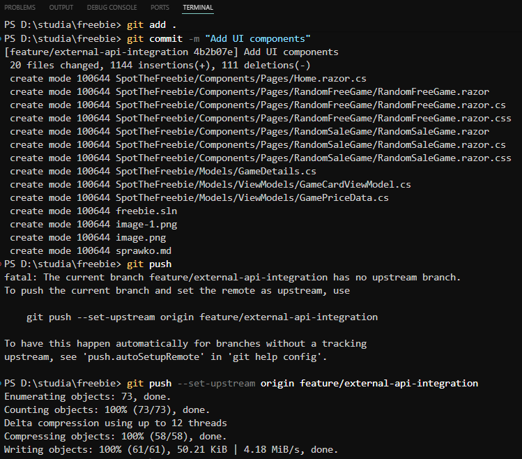
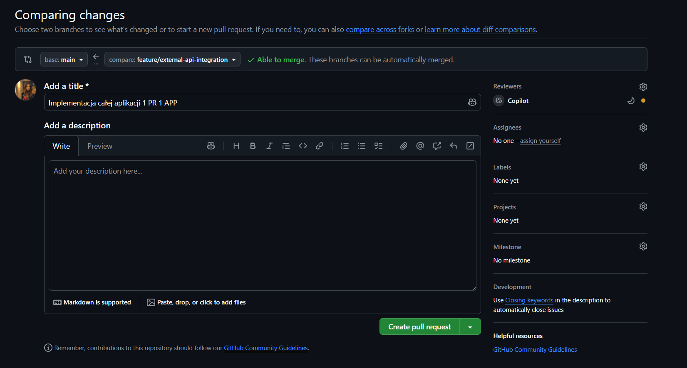
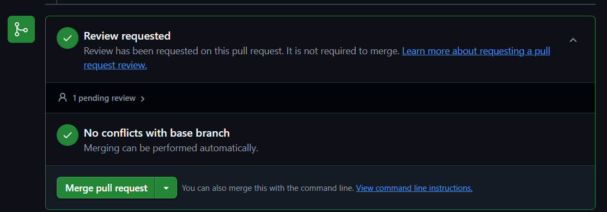
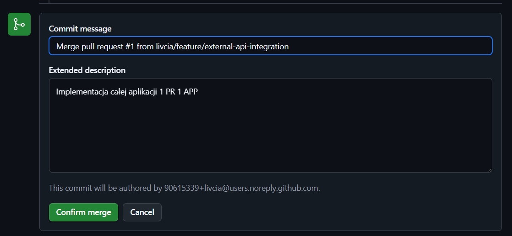

# Sprawozdanie z Laboratorium nr [X]
**Przedmiot:** Integracja Systemów Informatycznych  
**Temat:** Integracja z zewnętrznymi API i przetwarzanie danych  
**Data:** 27.04.2026  
**Student:** Oliwia Ankiewicz  

---

## 1. Cel laboratorium
Celem projektu było praktyczne wykorzystanie mechanizmów integracji systemów IT poprzez połączenie aplikacji z dwoma różnymi zewnętrznymi serwisami API. Skupiłam się na agregacji danych z serwisów FreeToGame oraz CheapShark.

## 2. Realizacja zadań
Podczas laboratoriów zrobiłam initial commit na main, zamiast na feature/external-api-integration

### Zadanie 1: Przygotowanie struktury
- **Opis działań:** Stworzyłam szkielet aplikacji w architekturze Blazor Server przy użyciu .NET 10. Skonfigurowałam strukturę katalogów (Components, Services, Models) oraz zainstalowałam bibliotekę Blazor.Bootstrap

- **Zastosowane komendy PowerShell:**
  ```powershell
  dotnet new blazorserver -o SpotTheFreebie
  dotnet add package Blazor.Bootstrap
  ```
- **Zastosowane komendy Git:**
  ```bash
  git remote add origin https://github.com/livcia/SpotTheFreebie.git
  git checkout -b main
  git add .
  git commit -m "initial commit (created blazor app)"
  git branch -d master
  git pull origin main
  git push -u origin main
  ```
- **Zrzuty ekranu / Fragmenty kodu:**
  

### Zadanie 2: Praca na gałęziach
- **Opis działań:** Przygotowałam (utowrzyłam) osobną gałąź dla projektu. 
- **Zastosowane komendy Git:**
  ```bash
  git checkout -b feature/external-api-integration
  git add .
  git commit -m "feat: add main page UI"
  ```
- **Zrzuty ekranu / Fragmenty kodu:**
  


### Zadanie 3: Integracja z zewnętrznym API (FreeToGame)
- **Opis działań:** Zaimplementowałam obsługę API FreeToGame. Stworzyłam odpowiednie modele danych (FreeGame) oraz serwis GameService, który za pomocą HttpClient pobiera listę darmowych gier.
- **Zastosowane komendy Git:**
  ```bash
  git add .
  git commit -m "implemented intergation with FreeToGame API"
  ```
- **Zrzuty ekranu / Fragmenty kodu:**
  

  **Serwis `GameService.cs`**:
  ```csharp
  using System.Net.Http.Json;
  using SpotTheFreebie.Models;
  namespace SpotTheFreebie.Services;
  public class GameService
  {
      private readonly HttpClient _http;
      public GameService(HttpClient http)
      {
          _http = http;
      }
      public async Task<FreeGame?> GetRandomFreeGameAsync()
      {
          var games = await _http.GetFromJsonAsync<List<FreeGame>>("https://www.freetogame.com/api/games");
          if (games == null || games.Count == 0) return null;
          return games[Random.Shared.Next(games.Count)];
      }
  }
  ```


  **Model `FreeGame.cs`:**
  ```csharp
  using System.Text.Json.Serialization;
  namespace SpotTheFreebie.Models;
  public class FreeGame
  {
      [JsonPropertyName("id")]
      public int Id { get; set; }
      [JsonPropertyName("title")]
      public string Title { get; set; } = string.Empty;
      [JsonPropertyName("genre")]
      public string Genre { get; set; } = string.Empty;
      // [...]
  }
  ```

### Zadanie 4: Integracja z drugim API (CheapShark)
- **Opis działań:** Rozbudowałam aplikację o integrację z API CheapShark, które dostarcza informacje o promocjach cenowych. Stworzyłam logikę pobierania ofert oraz model StoreDealViewModel
- **Zastosowane komendy Git:**
  ```bash
  git add .
  git commit -m "implemented intergation with CheapShark API"
  ```
- **Zrzuty ekranu / Fragmenty kodu:**  

  
    

  **Model `StoreDealViewModel.cs`:**
  ```csharp
  namespace SpotTheFreebie.Models.ViewModels;
  public class StoreDealViewModel
  {
      public GameDeal Deal { get; set; } = new();
      public Store? StoreInfo { get; set; }
  }
  ```

  **Logika pobierania promocji z CheapShark (`GameService.cs`):**
  ```csharp
  public async Task<PaidGame?> GetRandomPaidGameAsync()
  {
      await EnsurePageCountLoadedAsync();
      int page = Random.Shared.Next(0, _totalPageCount);
      var response = await _http.GetAsync($"https://www.cheapshark.com/api/1.0/deals?pageNumber={page}");
      if (response.StatusCode == System.Net.HttpStatusCode.TooManyRequests)
          response = await _http.GetAsync("https://www.cheapshark.com/api/1.0/deals");
      response.EnsureSuccessStatusCode();
      var games = await response.Content.ReadFromJsonAsync<List<PaidGame>>();
      if (games == null || games.Count == 0) return null;
      return games[Random.Shared.Next(games.Count)];
  }
  ```

### Zadanie 5: Własny endpoint API
- **Opis działań:** W pliku Program.cs zaimplementowałam własny endpoint /api/games/stats. Moim zadaniem było pobranie danych z obu serwisów jednocześnie, ich agregacja (wyliczenie statystyk gatunków i zestawienie najlepszych okazji) oraz zwrócenie przetworzonego obiektu w formacie JSON.
- **Zastosowane komendy Git:**
  ```bash
  git commit -m "Added internal endpoint"
  ```
- **Zrzuty ekranu / Fragmenty kodu:**    

  

  W ramach działania endpointu wykorzystałam operatory LINQ do przetworzenia pobranych danych:

  **Agregacja danych (Grupowanie i zliczanie):**
  Pogrupowanie darmowych gier według gatunku w celu znalezienia najpopularniejszych z nich.
  ```csharp
  var topGenres = freeGames?
      .GroupBy(g => g.Genre)
      .Select(g => new { Genre = g.Key, Count = g.Count() })
      .OrderByDescending(g => g.Count)
      .Take(5)
      .ToList();
  ```

  **Filtrowanie i wycinanie zakresu:**
  Odrzucenie rekordów, których nie da się sparsować, a następnie wyciągnięcie 10 największych promocji.
  ```csharp
  var topDeals = deals?
      .Where(d => double.TryParse(d.Savings, NumberStyles.Any, CultureInfo.InvariantCulture, out _))
      .OrderByDescending(d => double.Parse(d.Savings, CultureInfo.InvariantCulture))
      .Take(10)
      .Select(d => new
      {
          d.Title,
          d.SalePrice,
          SavingsPercent = Math.Round(double.Parse(d.Savings, CultureInfo.InvariantCulture), 1)
      }).ToList();
  ```

  **Funkcja agregująca na przefiltrowanym zbiorze (Średnia):**
  Odrzucenie gier darmowych (cena 0$), aby obliczyć średnią cenę promocyjną (Average).
  ```csharp
  var avgSalePrice = deals?
      .Where(d => double.TryParse(d.SalePrice, NumberStyles.Any, CultureInfo.InvariantCulture, out double v) && v > 0)
      .Select(d => double.Parse(d.SalePrice, CultureInfo.InvariantCulture))
      .DefaultIfEmpty(0)
      .Average();
  ```

### DODATKOWO:
  Pushnięcie zmian lokalnych na serwis github:

  Stworzenie PR:

  Merge z main:


## 3. Dokumentacja pracy z Gitem
- **Link do repozytorium:** [Link do Twojego repozytorium na GitHub]
- **Historia commitów:** [Wstaw zrzut ekranu z `git log --oneline` lub link do historii na GitHub]

## 4. Wnioski
Podczas pracy nad projektem po raz pierwszy zaimplementowałam obsługę zapytań HTTP za pomocą HttpClient. Była to również doskonała okazja do zapoznania się z bogatą ofertą darmowych interfejsów API. Napotkane problemy z limitem zapytań (Too Many Requests) uświadomiły mi, że przy następnej podobnej aplikacji niezbędne będzie zastosowanie warstwy cache’ującej oraz bardziej restrykcyjne zarządzanie częstotliwością odświeżania danych, aby uniknąć blokad ze strony dostawców API.